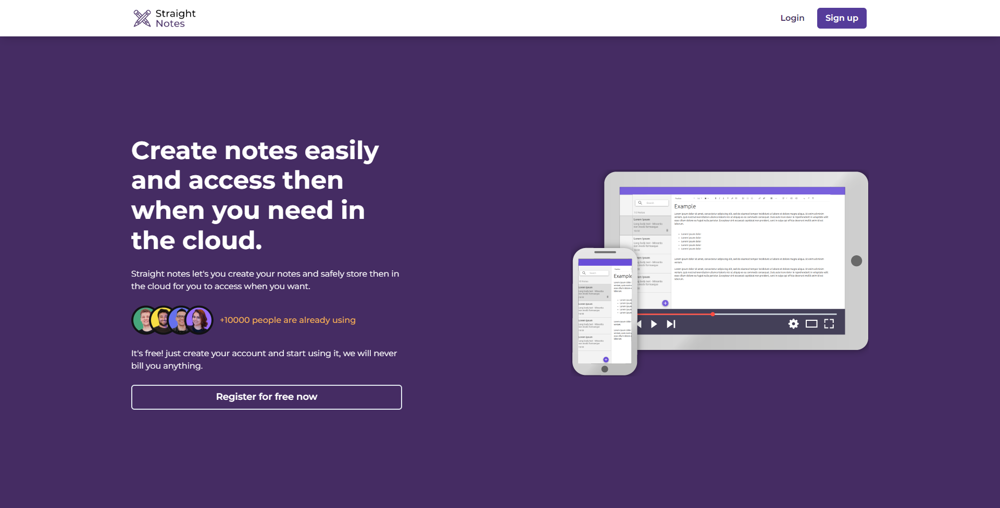
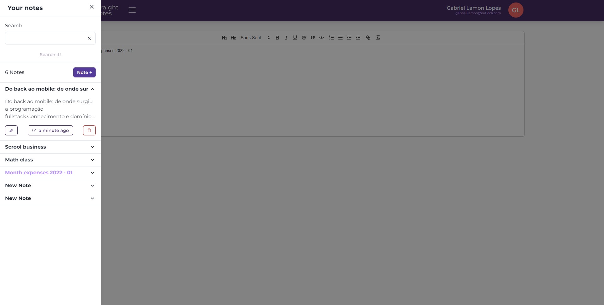
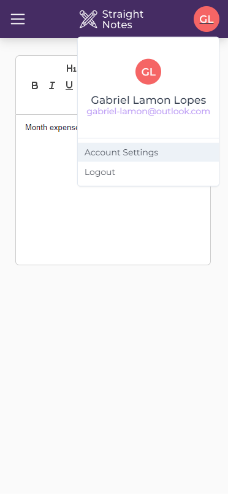

<br>
<br>
<h3 align="center">
  <div align="center">
    
  </div>
  <br><br>
  <b>Your notes best stored here, on the cloud.</b>
  <br>
</h3>

# Index

- [About](#about)
- [Functionalities](#functionalities)
- [Technologies](#technologies)
- [How to use](#how-to-use)

<a id="about"></a>

## :bookmark: About

Everybody needs to write, either it's for studying, or to better organize your tasks of the week, notes are universal. Straight notes comes to solve your problem: create, edit, and access your notes from anywhere in the globe, you just need some device that can access the web and a internet connection.

<div align="center">
    
</div>

## :zap: Check it out
[https://straight-notes-lamongabriel.vercel.app/](https://straight-notes-lamongabriel.vercel.app/)

<a id="functionalities"></a>

## :fire: Functionalities

- ### **Noting**

  - Create your notes.
  - Edit.
  - Delete if you don't need anymore.
  - List and search every note you have.
  - Access then anywhere you are, with a PC or mobile phone.

- ### **Security**

  - Create your account, safely.
  - Every user has it's own notes, just login and start using.
  - Update your account info.

<div align="center">
    
</div>

<a id="technologies"></a>

## :rocket: Technologies

The project is made with:
- [React JS](https://reactjs.org/)
- [TypeScript](https://www.typescriptlang.org/)
- [JWT](https://jwt.io/)
- [Node.js](https://nodejs.org/en/)
- [Express](https://expressjs.com/)
- [Bcryptjs](https://www.npmjs.com/package/bcryptjs)
- [Dotenv](https://www.npmjs.com/package/dotenv)
- [Mongo DB](https://www.mongodb.com/home)
- [Mongoose](https://mongoosejs.com)

<div align="center">
    
</div>

<a id="how-to-use"></a>

## :fire: How to Use

- ### **Dependencies**

  - Is **required** to install **[Node.js](https://nodejs.org/en/)**
  - In order to run scripts and install dependencies you need to install a **package manager**, like yarn.
  <br>

1. First step, clone this github repository:

```sh
  $ git clone https://github.com/lamongabrie/straight-notes.git
```

2. You need a mongoDB instance running your local machine, either install **[MongoDB community](https://www.mongodb.com/try/download/community)** and run it or as i prefer use **[Docker](https://www.docker.com/)**.

Docker example:

```sh
$ docker run -d -p 27017:27017 --name mongo_db_straight_notes mongo
```

3. Setting up the API
```bash
$ cd /api
$ touch .env
```
You must set up a .env file to continue, like the following example:
```
SERVER_PORT=3001
DATABASE_URL='mongodb://127.0.0.1:27017/straightnotes'
SECRET=justonesinglesecret
```
Then, run the API.
```bash
$ yarn
$ yarn dev
```

4. Setting up the client
```bash
$ cd /web
```
Create ```.env``` file at the root of the /web folder and define a VITE_API_URL.

```bash
  $ # Define .env called VITE_API_URL
  $ VITE_API_URL: https://localhost.local:3001
```

Then, run the client.
```bash
$ yarn
$ yarn dev
```
